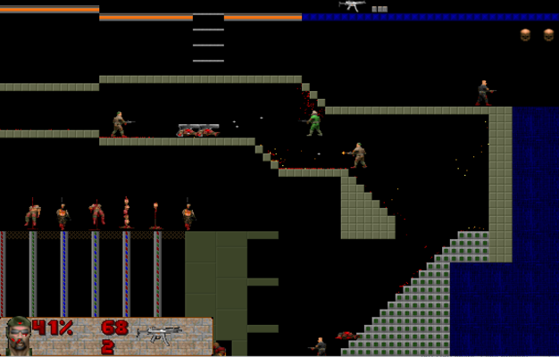

# DOOM RF (513)
**Release 1.5 [19.1.2002]**
DiVision (C) Andrey Ivanov (Pelipenko), 2002



## Системные требования
- CPU: 166Mhz (640x480)
- RAM: 4 Mb
- HDD: 4 Mb
- SVGA: 1 Mb
- OS: DOS, Win 9x/Me

## History

### RF:
Сегодня пятница, 13 (513). По теории вероятности должно произойти что-то
ужасное. И произошло!

### DOOM:
Главному Doome'ру не удалось победить кибердемона...

За свои деяния он попал в ад. Монстры его долго пытали, но вскоре им это
надоело, и они решили убить его окончательно. Сами они не осознавали того,
что Фюррер уже мертв и находится в аду, но все равно они решили совершить
доброе дело.

И вот ваш герой (злодей) готов бежать...

## Что в этой игре такого?
- Основное направление - deathmatch (2-4 игрока на одном компе, но можно и одному поиграть)
- Много крови, искр
- Разнообразное оружие, пули летят медленно, так чтобы от них можно было уворачиваться
- Нововведения: СуперШотган (скорострельный шотган), свастики (как звездочки - довольно мощные), огнемет (опасная штука в руках бота), заморозка - гуманный способ обезвреживания монстров
- Тупые монстры и умные боты (до 8), которые могут пройти сами всю игру
- Встроенный редактор уровней
- Телепорты, двери, ловушки, лифты
- Разрешение экрана 640x480
- Можно сохраняться
- Вы можете сами создать свой MOD к игре

## MODS

У каждого мода своя директория (пример - RF)

В `doom.ini` хранятся следующие настройки:
- `title` - заголовок игры (красный фон)
- `mainmod` - директория главного мода (RF)
- `runmod` - дополнительный мод

В `RUNMOD\` хранятся все настройки мода, дополнительные рисунки.
Если в моде нет какого-то рисунка, то он обращается к `MAINMOD\`.

В `MOD\mod.ini` хранятся основные настройки:
- `BMPdir` - директория с рисунками (может быть много)

Игра грузит все WAD-файлы из директории Mainmod и Runmod.

### Параметры запуска
```
rf.exe <runmod>
```

## Управление

| Действие    | 1(Center) | 2(Left)  | 3(PAD)   | 4(Mouse)     |
|-------------|-----------|----------|----------|--------------|
| Вправо      | Right     | D        | PgDn     | Left         |
| Влево       | Left      | A        | End      | Right        |
| Прыжок      | Up        | W        | Pad 5    | Up           |
| Вниз        | Down      | S        | Ins      | Down         |
| Стрелять    | Ctrl      | Tab      | +        | Left Button  |
| Стрелять2   | Alt       | CapsLock | NumLock  |              |
| ПредОружие  | Shift     | Q        | *        |              |
| СледОружие  | Enter     | ~        | -        | Right Button |

- Z - боты - за мной
- X - Стоять здесь
- C - В атаку!
- V - Замереть
- 1-9 - оружия
- F2, F3 - сохранить/загрузить игру
- F1 - показать фраги (в редакторе - средняя кнопка мыши)

### Стрелять под углом (только в одиночной игре)
PgUp, PgDn, Home, End

## Оружие

| Name         | Damage   | What         | From     | Solution |
|--------------|----------|--------------|----------|----------|
| Glock        | 5        | 9mm          | CS       | Оружие только для зомби, потому что нож лучше |
| Нож          | 15       | Blade        | SoF      | Подходите сзади, патронов не жалейте |
| Eagle        | 20       | 9mm+         | CS       | Базовое оружие в deatmatch'e |
| Автомат      | 5        | 9mm          | CS       | То же что и пистолет, но побыстрее |
| Пулемет      | 5        | 9mm          | Doom     | Патроны редко кончаются |
| Шотган       | 50       | 12mm         | Doom     | Заменяет нож в ближнем бою |
| AK 47        | 20       | 9mm+         | CS       | Короткая очередь убьет любого |
| RPG          | 90       | Rocket       | Doom     | То же, что и GL, но удобнее |
| BFG          | 200      | Energy cells | Doom     | Близко не стойте |
| Flamer       | 10/sec   | топливо      | Syndicat | Осторожно - ОГНЕОПАСНО |
| Freez rifle  | 10       | Energy cells | Doom     | Заморозка (20 сек) |
| SuperAvtomat | 8x5      | 12mm         | Original | Оружие массового уничтожения |
| GL           | 90       | Граната      | CS       | Удобно сбрасывать с высоты |
| Svastika     | 50       | Blade        | Original | Кидайте на пол |

## Editor

При желании вы можете сами сделать уровень - для этого выберите пункт в меню "редактор".

Если вы сделали свой уровень и хотите его протестировать - отредактируйте файл `RF\levels.ini`:
- `[Levellist-Single]` - порядок уровней для одного игрока
- `coop` - для кооперативного прохождения
- `death` - набор комнат для смертельного боя

### Инструменты

**Стены:**
- Ступень - монстр стоит на ней, но может и ходить сквозь нее
- `>>`, `<<` - Конвеер вправо и влево
- Function - не для редактора, а для самой игры
- DeathMatch - оружие или монстр только в смертельном бое

**Текстуры** - набор можно двигать справа и слева внизу

**Монстры, Предметы** - ставятся левой кнопкой, убираются правой

**Функции** - В функцию должны попасть ноги - тогда она сработает:
- Start1..4 - место появления игроков
- DIE - место появления в смертельном бое
- CHLEV - прохождение комнаты
- TELE - телепортация в TARGET со следующим номером
- Open, Close - открытие и закрытие двери TARGET со следующим номером

**Обои** - вводите значения от A140 до A160 (или помещайте свои обои в директорию `RF\WALL`)

### Nodes

Нужны для ботов. (макс узлов - 300)

- Не ставьте их слишком высоко от земли
- Не ставьте их слишком близко друг от друга - вам их не хватит
- Не ставьте их слишком далеко друг от друга - боты забудут, куда бежали

**Управление:**
- Левый щелчок - создать узел
- Правый - удалить
- Перетаскивание правой кнопкой на свободное место - перемещение узла
- Перетаскивание левой кнопкой на другой узел - соединить два узла (бот будет бегать)
- Перетаскивание правой кнопкой на другой узел - соединить два узла (бот будет прыгать)
- Перетаскивание средней кнопкой (или F1) на другой узел - одностороннее соединение

Если необходимо чтобы бот открыл дверь - поставьте туда какой-нибудь предмет.

## Проблемы
- Run-time error - записывайте все что на экране и давайте мне, исправлю :)
- Сохранялки старых версий не подходят

## Контакты

**DiVision (IVA vision)**
- Иванов (Пелипенко) Андрей "KindeX" (kindexz@gmail.com)
- Павел Бураков "Zonik[MMX]"
- Александр Родионов "Dark Sirius[MMX]"

*12g класс Гимназии Золитуде выпуска 2002 года*
